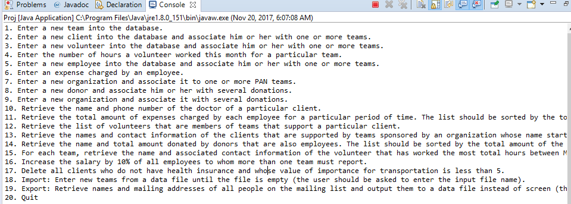
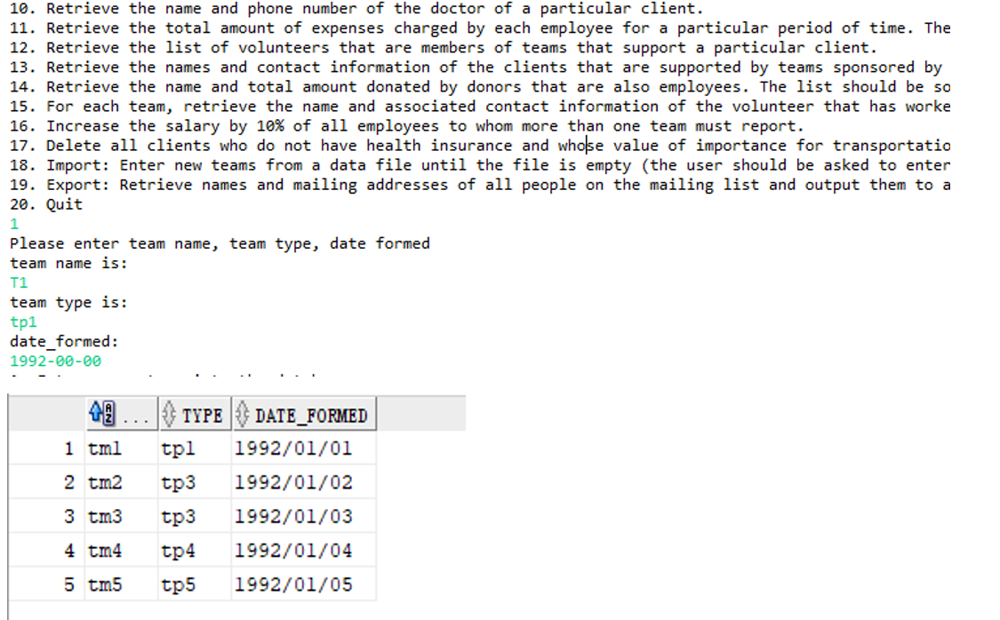
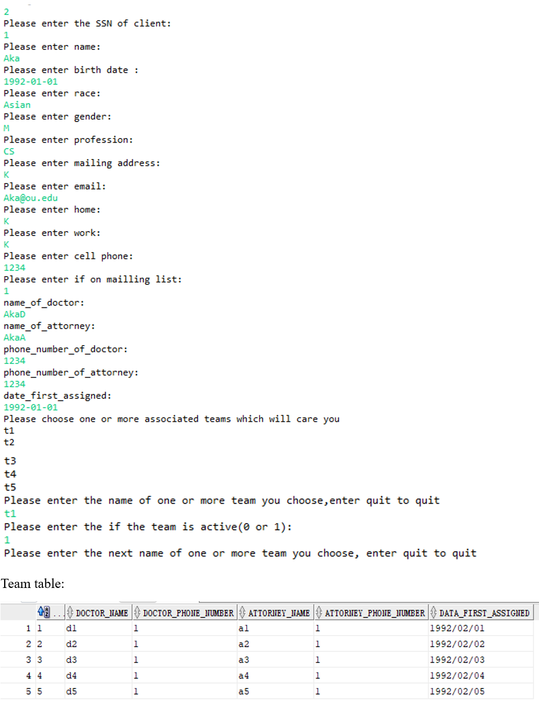
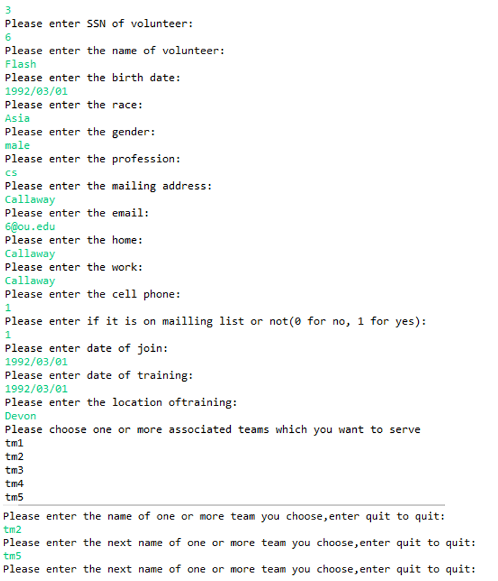
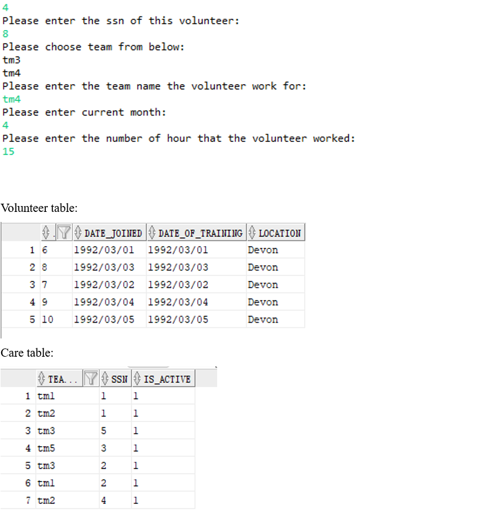
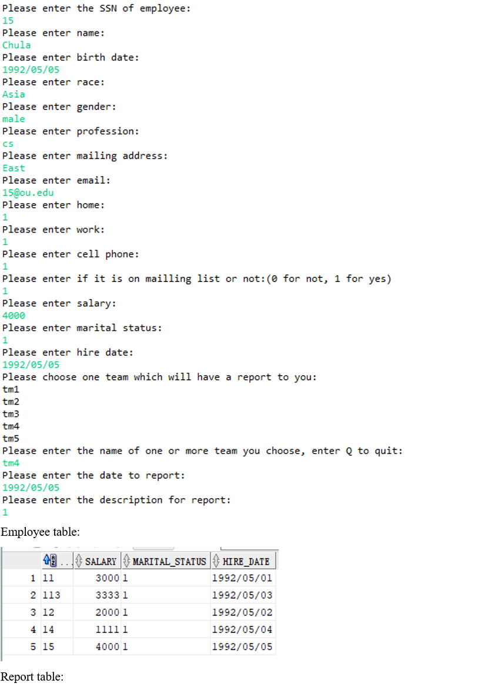

# Client and donor database system

The Patient Assistance Network (PAN) is a non-profit organization that provides support and care for patients.  PAN needs to implement a database system to keep track of the personnel necessary to support the organization.  In this project, I designed and implemented this database system.

## Usage

- Create the database using `database.sql`
- Set your sourceUrl in `Project.java`

    ```java
    13  String sourceURL = "";
    ```

- Run `Project.java`

    

- Execute the query
  - query1
    
  - query2
    
  - query3
    
  - query4
    
  - query5
    

## Authors

- Zhengguan Li
